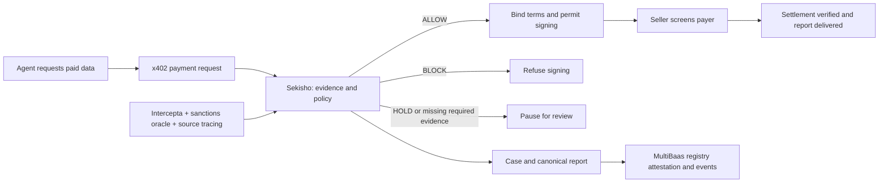

# Sekisho 関所

**A policy checkpoint for AI agent payments, before the signature.**

Sekisho screens the other party in an x402 payment, applies a deterministic policy,
and permits, pauses or refuses signing. It preserves the evidence behind that decision
and records a report fingerprint onchain through Curvegrid MultiBaas.

[Try the hosted demo](https://sekisho-phi.vercel.app/try/) ·
[Verified evidence](docs/LIVE-EVIDENCE.md) · [Setup](docs/SETUP.md) ·
[SDK](sdk/README.md) · [Documentation](docs/README.md)

Built for ETHGlobal Tokyo 2026. This is a testnet prototype and demo policy, not a
certified compliance programme or a guarantee that a wallet is safe.

## Try it

Open **https://sekisho-phi.vercel.app/try/**. Choose the standard vendor or flagged
recipient and select **Run real testnet trial**. No visitor wallet or API key is required.
The server funds a bounded 0.05 test-USDC purchase on Base Sepolia. Separately labelled
simulations remain available and never move money.

The public trial has persistent spending and request limits. If unavailable or exhausted,
it does not silently substitute a simulation. Recorded results remain visible on the page.

## What is verified

| Path | Observed result on 26 September 2026 |
|---|---|
| Hosted allowed purchase | Live screening → ALLOW → exact 0.05 test USDC settled → seller's sample report delivered |
| Hosted flagged purchase | Live risk evidence → BLOCK → REFUSED before payment signing |
| Decision evidence | Both report hashes checked; registry attestations confirmed and indexed; genuine webhooks delivered |
| Persistence | Both completed runs and their budget reservations survived a Render redeployment |
| Escrow contracts | Separate operator-driven deposit, premature-release rejection, clearance/release and refund rehearsal |

The **complete provider-triggered HOLD-to-escrow workflow remains unverified**.
The public HOLD outcome only pauses signing; it does not deposit into escrow.
The operator console is a separate private application, not an anonymously exposed service.
Full transaction links, addresses, limits and test scope are in
[LIVE-EVIDENCE.md](docs/LIVE-EVIDENCE.md) and [readiness.md](docs/readiness.md).

## How it works



The decision is bound to the recipient, amount, token and payment network. ALLOW is
permission to sign, not proof of settlement. The receipt verifier separately checks
the successful transaction and matching USDC transfer. The report hash establishes
byte consistency, not truth of the upstream risk signals. AI-generated explanations
cannot change the policy verdict; the hosted demo uses `LLM_PROVIDER=none`.

## Sponsor integrations

### Intercepta: live evidence at the payment boundary

- [API adapter](gate/sekisho_gate/screening/intercepta.py) and
  [screening pipeline](gate/sekisho_gate/screening/pipeline.py).
- [x402 payer/payee hooks](sdk/sekisho/x402_hooks.py) enforce the decision before
  buyer signing and seller acceptance.
- Direct Quick Scan is live in the hosted trial. Wallet screening uses mainnet risk
  evidence while transfers use testnet USDC; token checks map to the configured
  mainnet equivalent. Supporting cached checks are explicitly labelled.
- Missing required evidence fails closed. The source-of-funds trace is sampled and
  bounded; no traced history is not proof of safety.

**API feedback from actual use:**
1. Live Quick Scan supplied usable score/traits for the flagged address and explicit zero-score responses for the buyer and fresh merchant.
2. Verbatim trait descriptions made the refusal understandable without asking an LLM to invent a risk interpretation.
3. A direct scan timed out and a traced funder returned 404; distinguishing unavailable evidence from a clean response is essential.
4. The product and documentation use different domains; response examples for unknown wallets and quota exhaustion would make integration clearer.
5. One endpoint accepting the x402 recipient, asset, amount and authorization together would reduce payment-specific integration work.

### Curvegrid: onchain decisions and event delivery

[MultiBaas client](gate/sekisho_gate/chain/multibaas.py) composes and submits signed
application contract calls. [Attestations](gate/sekisho_gate/chain/attest.py) record
screening decisions; [authenticated webhooks](gate/sekisho_gate/webhooks.py) update
case state. [Setup](scripts/setup_multibaas.py) configures USDC, event queries and
webhook delivery. Initial contract deployment uses Foundry; runtime application
writes use MultiBaas.

**Experience from actual use:**
- REST contract calls and indexed events let the Python gate integrate without a separate indexer.
- The deployed registry/escrow and genuine webhook deliveries are verified on Base Sepolia.
- ABI-only upload needed `bin: "0x"`; a null bytecode field was rejected.
- Transaction-hash event lookup occasionally returned no rows despite indexing; a bounded receipt-derived block/index lookup resolved the exact event.
- Event-query pages are limited to 50 rows. Totals must be paginated and labelled correctly: cumulative deposits are not outstanding escrow.

## Run locally

Prerequisites: Python 3.11, Node.js 22/npm, Git and Foundry.

```bash
git clone --recurse-submodules https://github.com/MarcusC-ops/sekisho.git
cd sekisho
make install
test -f .env || cp .env.example .env
make check-setup
```

See [SETUP.md](docs/SETUP.md) to configure providers, fresh testnet signers, contracts
and the private console. Never put provider keys or signer secrets in browser variables.
For credential-free UI development, run `npm --prefix dashboard run dev:fixtures`;
its banner identifies synthetic data. Fixtures are not a live screening mode.

```bash
make test
npm --prefix dashboard run lint
npm --prefix dashboard run build
node --test website/try/state.test.mjs
node --test scripts/test-website-demo.mjs
```

[Public-trial deployment](docs/PUBLIC-TRIAL.md) uses one Render container and persistent
disk; the static website is served by Vercel. Only the limited runner and authenticated
webhook ingress are exposed publicly.

## Repository map

| Directory | Purpose |
|---|---|
| `gate/` | Screening adapters, deterministic policy, canonical reports, receipts, cases and audit events |
| `sdk/` | Python gate client and x402 payment hooks |
| `agents/` | Buyer, vendors, restricted public runner and local demo controls |
| `contracts/` | Registry, escrow, deployment script and Foundry tests |
| `dashboard/` | Private Next.js compliance console and development fixtures |
| `website/` | Public site and browser trial |
| `deploy/` | Persistent hosted stack |
| `scripts/` | Setup, testnet rehearsal and checks |
| `docs/` | Current operating documentation and verified evidence |
| `docs/archive/` | Historical specifications and plans retained for AI-development provenance |
| `docs/prompts/` | Recorded development instructions |

## Team, provenance and limitations

Repository maintained by Marcus Chia · [GitHub @MarcusC-ops](https://github.com/MarcusC-ops).
The team must confirm any additional members, roles and social handles before submission.

Claude Code and Codex assisted implementation, tests, documentation, design and deployment
under user direction. [AI usage](docs/ai-usage.md) identifies affected areas and remaining
human confirmations. Original specifications and planning records are in the
[archive](docs/archive/README.md); they are not current product promises.

The commercial pricing and customer-count examples in presentation material are
hypotheses, not revenue, traction or a measured total addressable market.
See the [submission checklist](docs/SUBMISSION.md) for the remaining release tasks.

## License

[MIT](LICENSE). Third-party dependencies and fonts retain their own licences.
[Asset provenance](docs/assets/README.md) distinguishes original artwork from labelled
fixture screenshots.
